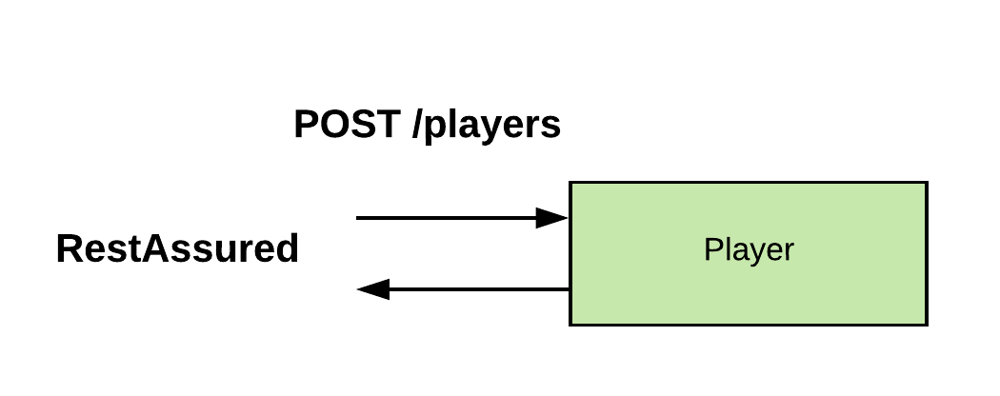
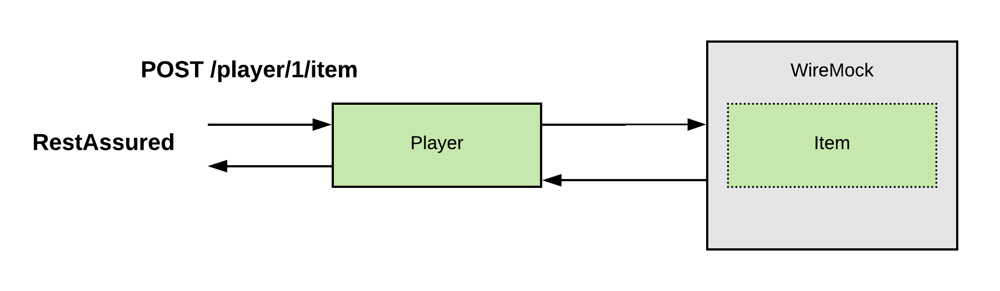

# Introduction
In this post, we will take a look at 3 libraries/tools for testing end points of web-services.   
## Content: 
1. Application under test
2. RestAssured  
2.1. Definition  
2.2. Main features  
2.3. Use case (diagram)  
3. WireMock  
3.1. Definition  
3.2. Main features  
3.3. Use case (diagram)  
4. Testcontainers  
4.1. Definition  
4.2. Main features  
4.3. Use case (diagram)  
4.4. Additional (Awatility)  
5. Summary

## 1. Application under test  
Application is a card-game RESTapi, build with: Spring-boot, kotlin, netflix tech stack (Zuul, Ribbon, Eureka) micro-services architecture. 
Project is exam delivery for subject PG6100-1 Java enterprise-2 at [Westerdals](https://www.westerdals.no/).
### 2. [RestAssured](https://github.com/rest-assured/rest-assured)  
### 2.1. Definition
Library for testing and validation REST APIs.  
### 2.2. Main features  
* Maven / Gradle integration  
* Json- Xml-, path for simple parse
* JVM languages support (Java, Kotlin, etc...)  
In current project RestAssured uses in each module, to perform http calls and validate responses.  
### 2.3. Use case 
Create new player.    
  
Setup RestAssured configuration.
`no.ern.game.player.controller.TestBase.kt`  
```
...

@Before
@After
fun clean() {
    // RestAssured configs shared by all the tests
    RestAssured.baseURI = <HOST>
    RestAssured.port = <PORT>
    RestAssured.basePath = "/players"
}
...
```         
Test example.  
`no.ern.game.player.controller.PlayerControllerTest.kt`
```
...
@Test
fun createAndGetPlayer_Valid() {
    val playerDto1 = getValidPlayerDtos()[0]
    
    val savedId = given().contentType(ContentType.JSON)
        .body(playerDto1)
        .post()
        .then()
        .statusCode(201)
        .extract().`as`(Long::class.java)
            
    ...           
}
```
## 3. [WireMock](http://wiremock.org)
WireMock is an HTTP mock server. Provide opportunity to test services in isolation.
### 3.1. Definition
This library gives opportunity to trigger outbound request, mock target service and stub response.
Wiremock provides range of opportunities to test microservices in isolation from each other.
### 3.2. Main features
* Mocking, stubbing, verifying, proxying  
* Support SSL (HTTPS)  
### 3.3. Use case  

Setup wiremock testbase.  
`no.ern.game.player.controller.WiremockTestBase.kt`  
```
companion object {
    lateinit var wiremockServerItem: WireMockServer
    
    @BeforeClass
    @JvmStatic
    fun initClass() {
        ...
        wiremockServerItem = WireMockServer(WireMockConfiguration.wireMockConfig().port(<PORT>).notifier(ConsoleNotifier(true)))
        wiremockServerItem.start()
    
    }
    
    @AfterClass
    @JvmStatic
    fun tearDown() {
        wiremockServerItem.stop()
    }
  
}        
```
Kotlin did not support `static` when application was developed (maybe it has been changed already), we used companion object instead.   
Test example.  
```
@Test
fun testAddItemToPlayer_Valid() {
    val playerDto1 = getValidPlayerDto()
    val savedId = RestAssured.given().contentType(ContentType.JSON)
        .body(playerDto1)
        .post()
        .then()
        .statusCode(201)
        .extract().`as`(Long::class.java)
  
    // stub rule 
    wiremockServerItem.stubFor(
        WireMock.get(urlMatching(".*/items/1"))
            .willReturn(
                WireMock.aResponse()
                    .withStatus(200)))
  
    val item = ItemDto(id = "1")
    
    val response = RestAssured.given()
        .contentType(ContentType.JSON)
        .body(item)
        .post("/$savedId/items")
        .statusCode(200)
```
## 4. [Testcontainers](https://www.testcontainers.org/)
### 4.1. Definition
In two words tests in docker containers. Testcontainers offers opportunities to test -integration, -application layers, and UI tests(i.e. with selenium).
### 4.2. Main features  
* Simple access layer integration test: MySQL, PostgreSQL & Oracle.  
* Tests against docker-compose environment
* Containerized web browsers, compatible with Selenium
* Opportunity to record video for UI tests
* Generic containers (use own images)
* Accessing containers from tests
### 4.3. Use case
We use this library for end-to-end tests, validation and check most important components in application. Application deployed in docker-compose environment, using local docker-compose and generic containers. 
* Validate infrastructure (gateway, service discovery and access)
* Validate microservices security access
* Validate main system features
* Validate game logic processes 
  
Setup docker-compose environment.
`no.ern.game.e2etests.AuthFeatureIT` 
```
...
companion object {

    class KDockerComposeContainer(path: File) : DockerComposeContainer<KDockerComposeContainer>(path)
    
    
    @ClassRule
    @JvmField
    val env = KDockerComposeContainer(File("../docker-compose.yml"))
        .withLocalCompose(true)
    
    @BeforeClass
    @JvmStatic
    fun initialize() {
        RestAssured.baseURI = "http://localhost"
        RestAssured.port = 10000
        RestAssured.enableLoggingOfRequestAndResponseIfValidationFails()
    
        await().atMost(240, TimeUnit.SECONDS)
            .ignoreExceptions()
            .until({
                given().get("http://localhost:10000/api/v1/user").then().statusCode(401)
    
                true
            })
    }
}
...

```   
Test example.  
`no.ern.game.e2etests.AuthFeatureIT`   
```
...
@Test
fun testLogin() {
    val id = createUniqueId()
    val pwd = "bar"
    
    val cookies = registerUser(id, pwd)
    
    given().get("/api/v1/user")
        .then()
        .statusCode(401)
    
    //note the difference in cookie name
    given().cookie("SESSION", cookies.session)
        .get("/api/v1/user")
        .then()
        .statusCode(200)
        .body("name", equalTo(id))
        .body("roles", contains("ROLE_USER"))
    
    
    given().auth().basic(id, pwd)
        .get("/api/v1/user")
        .then()
        .statusCode(200)
        .cookie("SESSION")
        .body("name", equalTo(id))
        .body("roles", contains("ROLE_USER"))
}
...
```

### 4.4. Additional [Awatility](https://github.com/awaitility/awaitility)  
Java library for sync async operations. It is very convenient tool to write automated test in async environment.
```
await().atMost(240, TimeUnit.SECONDS)
    .ignoreExceptions()
    .until({
        given().get("http://localhost:10000/api/v1/user").then().statusCode(401)

        true
})
```
We use it at: 
* Waiting until all nodes in application will be deployed, registered in service discovery and be accessible.
We wait max 4 minutes, while waiting call gateway with RestAssured GET /user in a loop until success, 
ignore any exceptions. Success symbolize that last microservice in application is UP and system  run tests, if timeout riches than fail test suite
* Async operations: message broker processing, node communications and etc...

## 5. Summary  
Well, that was short overview of testing tools for web-services and application with microservice architecture. 
RestAssured and WireMock libraries are well known among java developers. Testcontainers is something "new" (5 years history) to automate settings of containers environment. 
TestContainers run containers for automated tests and destroy them right after. Testcontainers library decreases integrated tests complexity. 
And 'YES', you do not need install anymore Oracle database to run tests.   

## Links  
* [TestContainers - Richard North](https://vimeo.com/222501136) 
* [Testcontainers - Geekout EE 2017 presentation](https://www.slideshare.net/rich.north/testcontainers-geekout-ee-2017-presentation)


